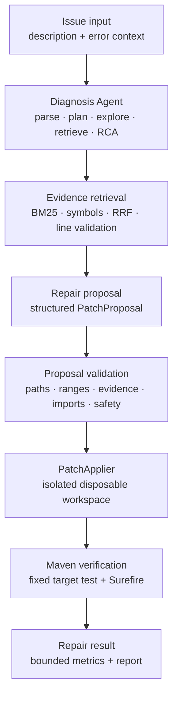

# SpringFix-Agent

SpringFix-Agent is an engineering prototype for automated diagnosis and code
repair in Java/Spring Boot projects. It combines an Agent workflow with
deterministic evidence checks, safe patch application, and restricted Maven
verification.

The project demonstrates a complete repair path:

- bug diagnosis from an issue description and error context;
- production-code retrieval and bounded evidence validation;
- structured repair-proposal generation;
- deterministic proposal validation;
- patch application inside a disposable isolated workspace;
- fixed-target Maven/Surefire verification; and
- bounded, sanitized traces and benchmark artifacts.

This repository is a research and engineering demonstration, not an
autonomous production repair service.

## Architecture



Detailed responsibilities are documented in [docs/architecture.md](docs/architecture.md).

## Technical stack

| Area | Technology / approach |
|---|---|
| Runtime | Python 3.11, `uv`, Pydantic settings/models |
| Agent workflow | LangGraph-style state graph with explicit nodes and state |
| LLM | Mock client for tests; OpenAI-compatible live provider interface |
| Code retrieval | BM25 lexical retrieval, Java identifier/symbol retrieval, RRF fusion |
| Diagnosis | Structured issue parsing, planning, repository exploration, RCA, evidence capture |
| Patch generation | Structured `PatchProposal` with old/new code, rationale, and verification steps |
| Patch safety | Deterministic path, line-range, evidence, import, scope, and sensitive-content checks |
| Java analysis | Java/Spring source inspection and bounded symbol/evidence validation |
| Verification | Java 21 where available, restricted Maven invocation, Surefire XML oracle |
| Persistence | SQLite or in-memory task repository for local service workflows |
| Benchmarking | Dev, legacy benchmark, and blinded Fresh Holdout protocols |
| CI | GitHub Actions with Python quality and Java/Maven benchmark verification jobs |

## Benchmark design

The benchmark separates development evidence from unseen evaluation evidence.

- **Dev Benchmark:** the six-case Semantic Dev set used for controlled
  development and diagnosis-observability work.
- **Fresh Holdout v2:** eight genuinely fresh cases frozen before the live
  evaluation. The Agent-facing projection excludes solution material.
- **Freeze protocol:** baseline behavior, sample restoration, manifest state,
  novelty, and execution readiness are checked before evaluation.
- **Gold isolation:** Repair Gold and reference patches remain outside the
  Agent-facing projection and are not read by the live Agent runtime.
- **Anti-tuning lock:** no case-specific tuning, prompt adjustment, selective
  rerun, or failed-case retry is allowed after the holdout is frozen.
- **One-shot evaluation:** Fresh Holdout v2 permits exactly one live Agent
  execution. Provider, runner, or artifact failures follow the declared
  invalid-run policy rather than being silently rerun.

The benchmark design and integrity rules are described in
[docs/benchmark.md](docs/benchmark.md). This documentation intentionally does
not reproduce Gold answers or reference patches.

## Evaluation results

### M7E Dev result

The current Semantic Dev repair result is **6/6**. M7E explicitly records this
as stable performance on the current Dev set, not universal generalization.

### M7F Fresh Holdout v2 result

Fresh Holdout v2 completed one valid one-shot run:

| Case | Result |
|---|---|
| `h01` | FAIL |
| `h02` | FAIL |
| `h03` | PASS |
| `h04` | FAIL |
| `h05` | PASS |
| `h06` | PASS |
| `h07` | PASS |
| `h08` | PASS |

**Repair Success: 5/8 (62.5%)**

Release decision: **NO-GO FOR UNCONDITIONAL PRODUCTION RELEASE**.

Current status: **HOLD FOR AUTHORIZED FOLLOW-UP**. Diagnosis V2.2 is a
secondary observational metric and does not change Repair Success.

See [docs/evaluation.md](docs/evaluation.md) for the full M7E/M7F decision
record and failure classification.

## Failure analysis

- **h01 / h02:** proposal-validation boundary failures. The retained bounded
  artifacts do not contain enough proposal audit detail to distinguish an
  Agent proposal-generation issue from a proposal/validator contract mismatch.
- **h04:** verification/test failure after patch application. Maven reached the
  target-test path, but the repaired case did not pass verification.
- **Primary RCA:**
  `MIXED_REPAIR_PIPELINE_LIMITATION_AND_AGENT_VERIFICATION_FAILURE`.
- No invalid run, benchmark defect, or artifact-corruption basis was found.

## Limitations

SpringFix-Agent is not production-ready autonomous repair software. Important
limitations include:

- proposal-boundary observability is not yet detailed enough for every failed
  proposal to be attributed below the validation boundary;
- the current repair path is single-shot and has no automatic iterative repair
  feedback loop;
- Maven verification is restricted and process-safe, but is not a complete OS,
  container, network, or supply-chain sandbox;
- Dev performance does not establish generalization to unseen Spring bugs;
- Diagnosis V2.2 has limited lexical generalization and remains observational;
- the benchmark is small and is not a production accuracy estimate; and
- the repository has no product UI, so no fabricated screenshots are included.

More detail is in [docs/limitations.md](docs/limitations.md).

## Future work

Future work should be separately authorized and evaluated rather than applied
to the frozen result retroactively:

1. improve bounded proposal-generation and rejection audits;
2. expose actionable deterministic validation feedback without retaining raw
   model output or hidden reasoning;
3. evaluate an iterative repair loop with explicit retry budgets and audit
   boundaries; and
4. add human-in-the-loop approval before applying a repair to a user repository.

## Quick start

Install development dependencies and run the local quality suite:

```powershell
uv sync --extra dev
uv run ruff check src/ tests/ scripts/
uv run mypy --strict src/
uv run pytest tests/ -v
```

The default local LLM mode is Mock. Live provider execution is opt-in and is
not required for tests or CI. Never commit API keys or `.env` contents.

## Documentation map

- [Architecture](docs/architecture.md)
- [Benchmark design](docs/benchmark.md)
- [Evaluation and release decision](docs/evaluation.md)
- [Limitations and future work](docs/limitations.md)

## Project status

- Runtime: `0.15.1`
- M7E closeout: `PASS`
- M7F-0 freeze/readiness: `PASS`, with a documented pre-existing provenance
  mismatch
- M7F-1 evaluation: `COMPLETED`, Repair Success `5/8`
- M7F-1A: `PASS_RCA_ONLY`
- M7F-2: `FINAL_ANALYSIS_ONLY`
- Release: **HOLD — no unconditional production release**
