# SpringFix-Agent Architecture

## System boundary

SpringFix-Agent accepts an issue description, optional error context, and a
repository path. It produces a diagnosis, a reviewable repair proposal, and,
when the proposal passes deterministic checks, a verification result from an
isolated workspace.

```mermaid
flowchart LR
    Input[Issue input]
    Graph[Diagnosis state graph]
    Retrieval[Code retrieval]
    RCA[Root-cause analysis]
    Evidence[Validated evidence]
    Proposal[Patch proposal]
    Validator[Deterministic validator]
    Workspace[Isolated patch workspace]
    Maven[Restricted Maven/Surefire verifier]
    Result[Repair result + artifacts]

    Input --> Graph
    Graph --> Retrieval
    Retrieval --> RCA
    RCA --> Evidence
    Evidence --> Proposal
    Proposal --> Validator
    Validator --> Workspace
    Workspace --> Maven
    Maven --> Result
```

## Diagnosis workflow

The diagnosis graph is stateful and separates reasoning steps from tools:

1. `validate_input` checks the task boundary.
2. `issue_parser` turns issue text and logs into structured context.
3. `task_planner` selects bounded investigation steps.
4. `explore_repository` creates a safe repository view.
5. `retrieve_code` searches production code and records retrieval diagnostics.
6. `root_cause_analyzer` produces structured candidates and evidence references.
7. A diagnostic report is emitted with bounded status and evidence metadata.

The Agent does not receive arbitrary command execution. Repository content and
error logs are treated as untrusted input, and prompt-injection defenses are
covered by regression tests.

## Repair workflow

### Code retrieval and evidence

Retrieval combines lexical BM25 search, Java identifier/symbol signals, and
reciprocal-rank fusion. Root-cause evidence must refer to real files and valid
line ranges inside the Agent-facing repository view.

### Repair proposal

The proposal stage returns a structured `PatchProposal`. A proposal describes
candidate edits, old/new code, rationale, assumptions, risks, and verification
steps. Proposal generation is review-oriented; it does not write files.

### Proposal validation

The deterministic validator checks:

- relative paths inside the allowed production-code/resource prefixes;
- valid and non-overlapping line ranges;
- exact old-code matches;
- non-empty, changed new code;
- overlap with validated evidence;
- Java import completeness;
- forbidden files and sensitive-content patterns; and
- atomic acceptance of the original edit set.

### PatchApplier

PatchApplier copies the allowed repository view into a disposable isolated
workspace. It performs a preflight pass, applies edits deterministically, emits
a bounded diff, and checks that the original repository, tests, and `pom.xml`
remain unchanged.

### Maven verification

The verifier constructs the command internally, uses a trusted target-test
selector, runs with a restricted child environment, and parses Surefire XML.
Repair Success requires baseline reproduction, valid proposal, complete edit
application, repository/test/pom integrity, target-test execution, Maven exit
code zero, and zero failures/errors/skips.

## Observability and safety

Node, tool, and LLM activity are tracked separately. Persisted artifacts are
bounded and sanitized: they exclude API keys, raw provider responses, full
prompts, hidden reasoning, temporary absolute paths, and Gold payloads.

The system is intentionally single-shot at the benchmark boundary. It does not
silently retry a failed case or turn a failed run into a success by changing
the prompt, evaluator, or benchmark.

## Runtime components

| Component | Responsibility |
|---|---|
| API/service layer | Accept tasks, run the graph, expose status/traces/reports |
| Graph state | Carry structured issue, retrieval, diagnosis, and report state |
| Retrieval package | Tokenization, indexing, BM25, symbols, fusion, metrics |
| Repair package | Proposal models, generator, validator, applier, verifier |
| Storage package | In-memory and SQLite task/report persistence |
| Benchmark package | Repository views, manifests, case runners, scoring, diagnosis metrics |
| Artifact writers | Redacted JSON/Markdown reports and integrity metadata |

There is no product UI in the repository. Demonstrations should use the API,
CLI output, or real screenshots supplied by a user; this project does not
generate placeholder screenshots.
